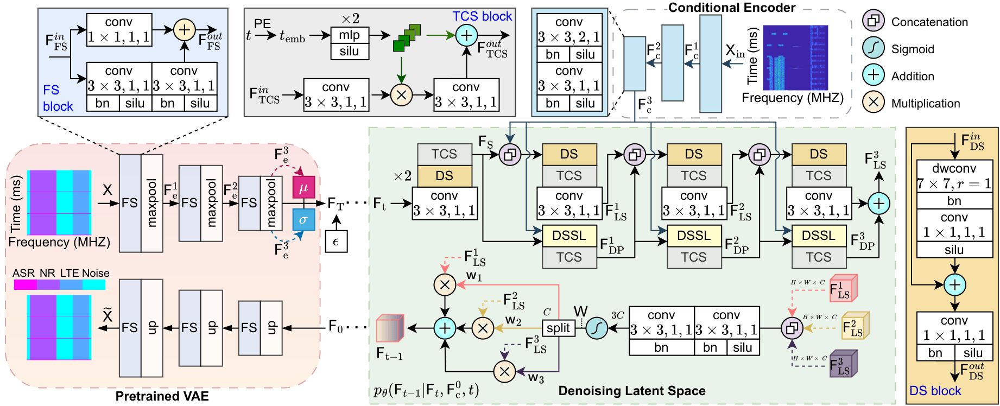
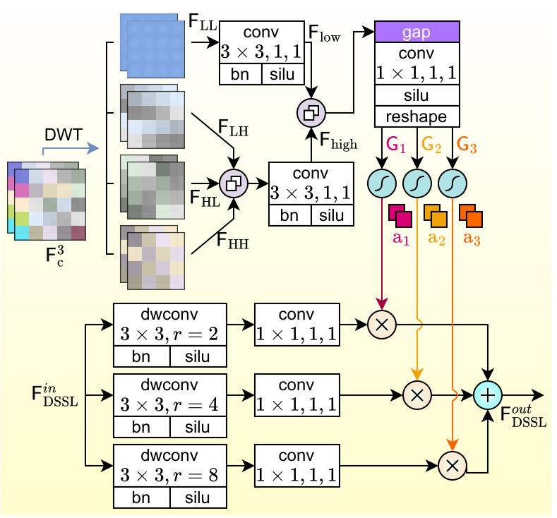

# ReSpecNet

Efficient spectrum sensing (SS) is crucial for optimizing wireless network performance, particularly in environments where fifth-generation new radio (5G NR) and long-term evolution (LTE) systems coexist with incumbent radar installations. Traditional SS methods face significant challenges, including low signal-to-noise ratio (SNR) environment, multipath fading, and high computational complexity, which limit their effectiveness in real-world scenarios. While deep learning (DL) based approaches have emerged as promising solutions offering superior adaptability, existing models often struggle with the trade-off between accuracy and computational efficiency. Moreover, they face difficulties in precisely segmenting signal boundaries in the frequency domain, especially in resource-constrained environments. To address these limitations, this paper introduces a novel Rectified Flow (RF) Spectrogram Network (ReSpecNet), which integrates a dual-branch convolutional architecture with a conditional RF mechanism to enhance SS capabilities. ReSpecNet is designed to process spectrograms through specialized Time-Conditional Squeeze (TCS) and Dynamic Selective Spectrum Layer (DSSL) modules, enabling precise pixel-level segmentation of 5G NR, LTE, and airport surveillance radar (ASR) signals. The model employs a deterministic flow process to iteratively refine segmentation masks, achieving high fidelity even in low SNR conditions. Extensive experiments demonstrate that ReSpecNet outperforms state-of-the-art methods in both segmentation accuracy and computational efficiency, making it a practical solution for real-time SS tasks. The proposed model is lightweight, with only 6.2M parameters and an inference time of 6.56 ms, while achieving a mean accuracy (mAcc) of 78.66% and a mean intersection-over-union (mIoU) of 65.21%.

  

  

## Contact
If there is any error or need to be discussed, please email to [Phuoc-Long Huynh](https://github.com/Phuoc-LongHuynh) via hphuoclong24@gmail.com.
